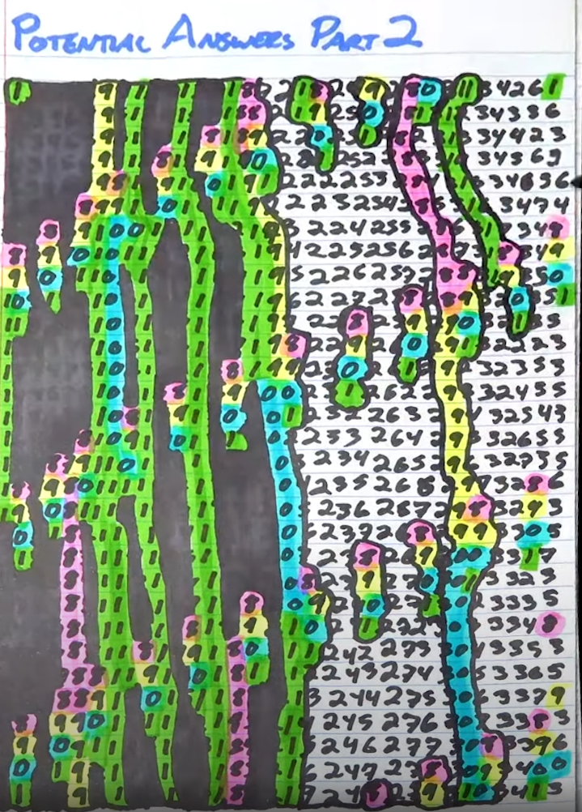
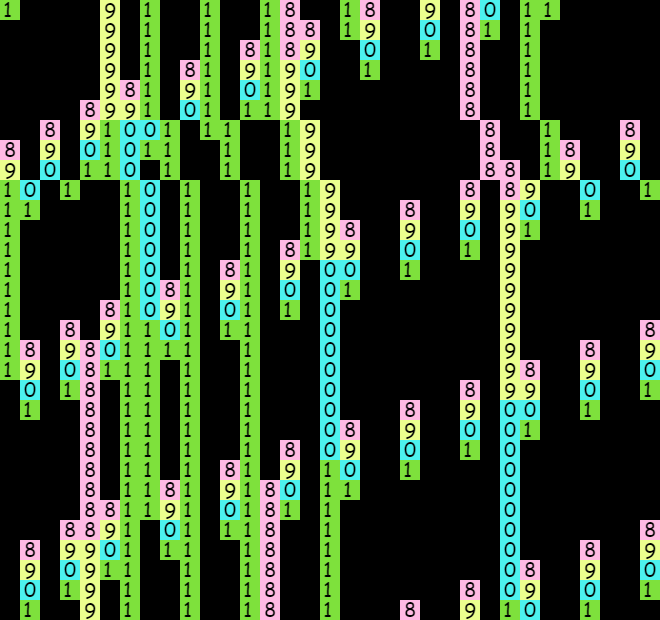

# Math Art Doodle

Vihart had a math video, [only 0.000000001% of people will understand this video](https://youtu.be/Twik7wqdwZU?t=730) with a colorful number art doodle at the end.

* 

Here is a HTML5 + Javascript program to explore this.

* 

You can:

* customize the colors for each digit
* change the dimensions of the 2D grid

Click Here --> [DEMO](https://htmlpreview.github.io/?https://github.com/Michaelangel007/number_art_doodle/blob/master/index.html) <-- Click Here

Last Updated: Oct 30, 2022.
